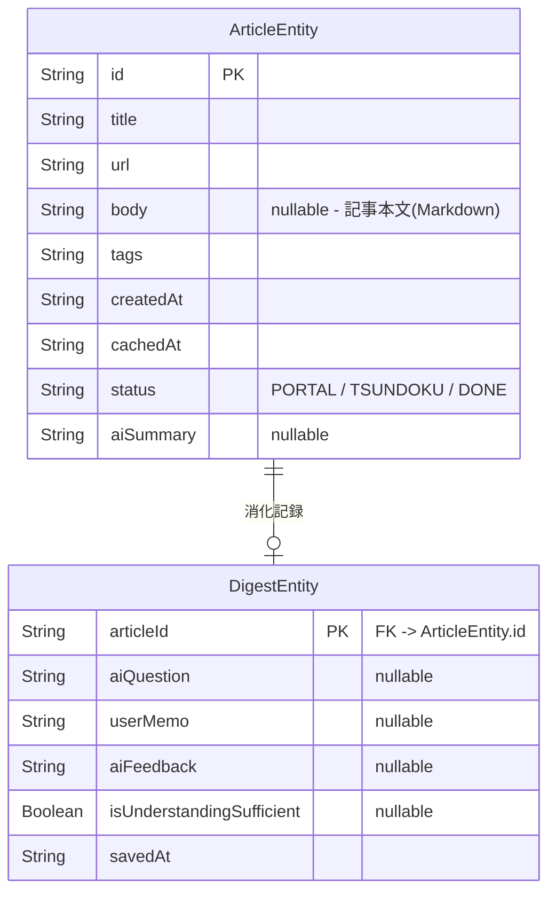
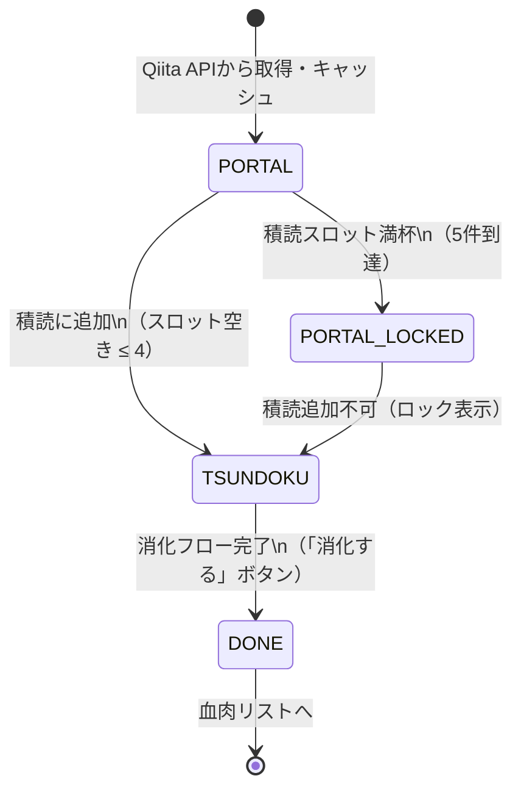

# Tech-Digest データベース設計ドキュメント

## 概要

ローカルDBには **Room** を使用する。
Qiita APIから取得した記事のオフラインキャッシュと、消化フローの記録を管理する。

---

## テーブル構成



テーブルは2つ。記事情報（ArticleEntity）と消化記録（DigestEntity）が1対0〜1の関係を持つ。

---

## ArticleEntity（記事情報）

Qiita APIから取得した記事をキャッシュするテーブル。記事のライフサイクル管理も担う。

| カラム | 型 | Nullable | 説明 |
|-------|-----|----------|------|
| `id` | String | NO | Qiita記事ID（主キー） |
| `title` | String | NO | 記事タイトル |
| `url` | String | NO | 記事URL |
| `body` | String | YES | 記事本文（Markdown形式）。Qiita API の `body` フィールド。AI機能の入力として使用。長い場合は先頭10,000文字を保存 |
| `tags` | String | NO | タグ一覧（JSON配列文字列） |
| `createdAt` | String | NO | Qiitaでの投稿日時（ISO 8601） |
| `cachedAt` | String | NO | ローカルへのキャッシュ日時（ISO 8601） |
| `status` | String | NO | 記事の状態（後述） |
| `aiSummary` | String | YES | AI生成の要約（記事全文ベース）。未生成時はnull |

### status の状態遷移



| 値 | 画面 | 説明 |
|----|------|------|
| `PORTAL` | ポータル画面 | Qiitaから取得したトレンド記事 |
| `TSUNDOKU` | 積読リスト画面 | ユーザーが積読に追加した記事（最大5件） |
| `DONE` | 血肉リスト画面 | 消化フローを完了した記事 |

---

## DigestEntity（消化記録）

消化フローの進行状況を記録するテーブル。消化フロー開始時に作成され、各ステップで段階的にカラムが埋まる。

| カラム | 型 | Nullable | 説明 |
|-------|-----|----------|------|
| `articleId` | String | NO | ArticleEntity.id への外部キー（主キー） |
| `aiQuestion` | String | YES | AIが記事全文を読んで生成した理解度チェックの問い。問い生成前はnull |
| `userMemo` | String | YES | ユーザーが入力した1行メモ。入力前はnull |
| `aiFeedback` | String | YES | AIが返したフィードバック本文。取得前はnull |
| `isUnderstandingSufficient` | Boolean | YES | AIによる理解度評価結果。true=十分/false=不十分。評価前はnull |
| `savedAt` | String | NO | 消化記録の作成日時（ISO 8601） |

### 消化フローとカラムの対応

```
消化フロー開始
  └─ DigestEntity 作成（aiQuestion / userMemo / aiFeedback / isUnderstandingSufficient はすべてnull）
       ↓
  AIが記事全文を読んで問いを生成
  └─ aiQuestion を更新
       ↓
  ユーザーが1行メモを入力・送信
  └─ userMemo を更新
       ↓
  AIがフィードバックを返す + 理解度を評価
  └─ aiFeedback を更新
  └─ isUnderstandingSufficient を更新（true/false）
       ↓
  isUnderstandingSufficient == true の場合のみ
  「消化する」ボタン有効化 → ArticleEntity.status を DONE に更新
```

### 読了ゲートのロジック

`isUnderstandingSufficient` が `false` の場合、UI は「消化する」ボタンを無効化し、ユーザーに再回答を促す。
ユーザーが再度メモを送信すると `GenerateFeedbackUseCase` が再実行され、`isUnderstandingSufficient` が上書き更新される。

---

## クエリ操作一覧

### ArticleDao

| メソッド | 戻り値 | 説明 |
|---------|--------|------|
| `getArticlesByStatus(status)` | `Flow<List<ArticleEntity>>` | 状態別の記事一覧取得（各画面の一覧表示に使用） |
| `getTsundokuCount()` | `Flow<Int>` | TSUNDOKU状態の件数監視（5件制限の制御） |
| `getArticleById(id)` | `Flow<ArticleEntity?>` | 記事詳細取得 |
| `insertArticles(articles)` | `Unit` | 記事の一括挿入・更新（OnConflict: REPLACE） |
| `updateStatus(id, status)` | `Unit` | ステータス更新（積読追加・消化完了） |
| `updateSummary(id, summary)` | `Unit` | AI要約の保存 |

### DigestDao

| メソッド | 戻り値 | 説明 |
|---------|--------|------|
| `insertDigestRecord(record)` | `Unit` | 消化記録の新規作成 |
| `getDigestRecord(articleId)` | `Flow<DigestEntity?>` | 消化記録の取得（血肉リスト詳細・フィードバック確認） |
| `updateQuestion(articleId, question)` | `Unit` | AI生成の問いを保存 |
| `updateFeedback(articleId, memo, feedback, isUnderstandingSufficient)` | `Unit` | メモ・AIフィードバック・理解度評価を保存 |

---

## 設計上のポイント

### オフラインキャッシュ

ArticleEntity がQiita APIのキャッシュを兼ねる。
ネット未接続時はRoomのFlowから記事一覧を取得し、そのままUIに流す。

```
オンライン: Qiita API → Room（REPLACE） → Flow → UI
オフライン: Room（キャッシュ） → Flow → UI
```

### 積読スロット制限

`getTsundokuCount()` をFlowで返し、ViewModelが常時監視する。
5件到達時にポータル画面の「積読に追加」ボタンをロック状態にする。

### DigestEntityの段階更新

消化フローは複数ステップに分かれるため、1レコードを段階的に更新する設計とする。
消化フロー中断・再開を考慮し、nullableカラムで各ステップの完了状態を表現する。

### body フィールドと AI 活用

`ArticleEntity.body` は Qiita API の `body` フィールド（Markdown）をそのまま保存する。
AI 機能（要約・問い・フィードバック）はすべてこの `body` を入力として使用する。
本文が長い場合は先頭 10,000 文字に切り詰めてプロンプトに渡す（トークン節約）。
