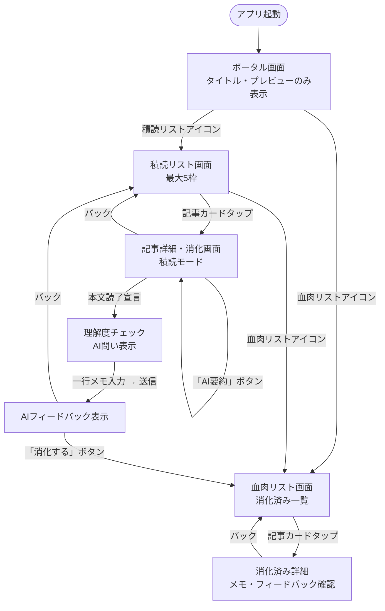
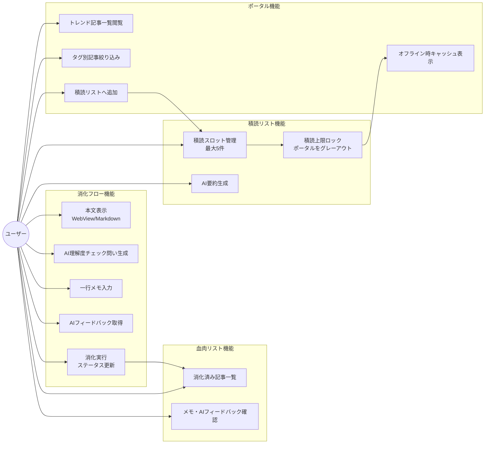
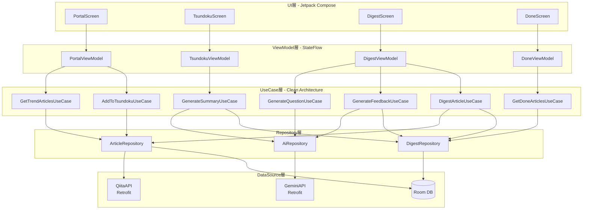
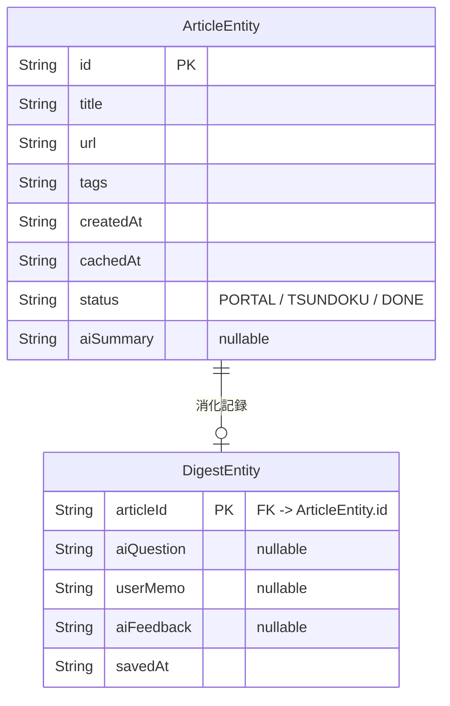
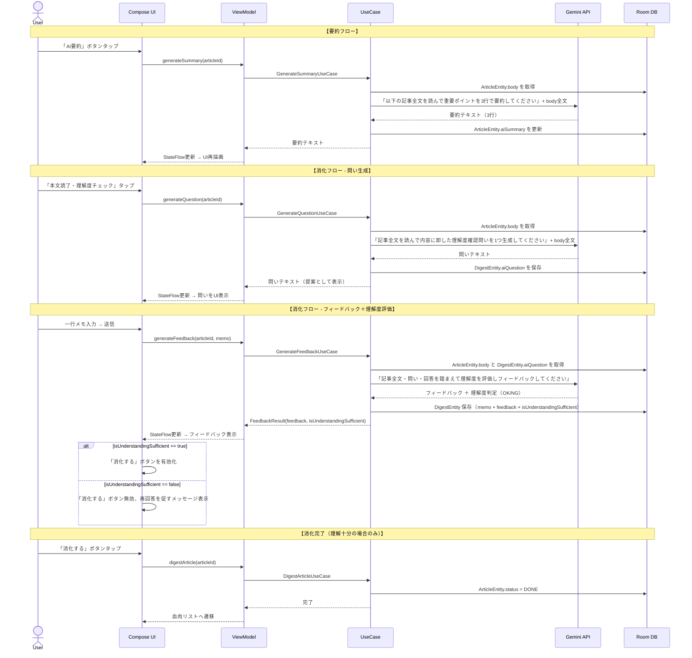
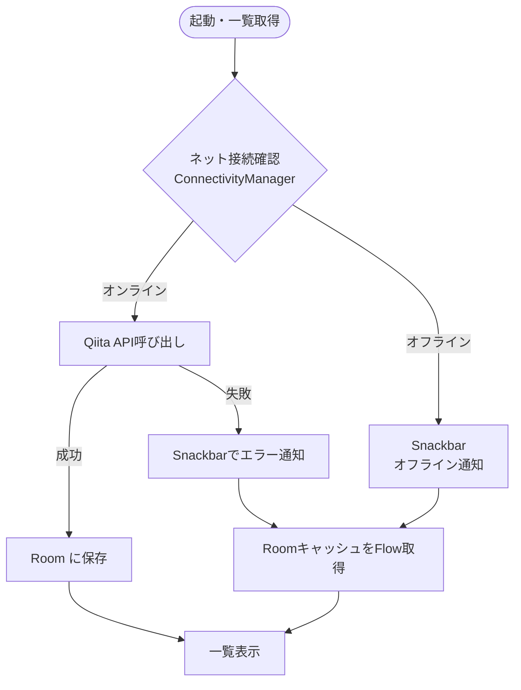
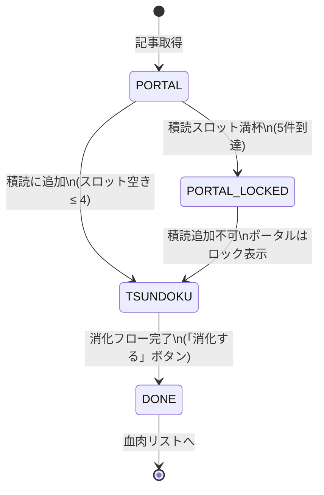

# Tech-Digest 基本設計ドキュメント

## 1. 画面フロー



---

## 2. 機能設計（ユースケース図）



---

## 3. アーキテクチャ構成



---

## 4. Roomデータベース設計



---

## 5. AIフロー設計

### AI入力データについて

すべての AI 操作（要約・問い・フィードバック）は **記事タイトルではなく記事全文（body）** を使用する。
Qiita API の `/api/v2/items` が返す `body`（Markdown形式）を `ArticleEntity.body` に保存し、AI プロンプトに渡す。
本文が長い場合は先頭 10,000 文字に切り詰めて使用する。



### FeedbackResult — フィードバックと理解度評価のペア

`GenerateFeedbackUseCase` は文字列ではなく以下のデータクラスを返す:

```kotlin
data class FeedbackResult(
    val feedback: String,               // ユーザーへのフィードバック本文
    val isUnderstandingSufficient: Boolean,  // 理解度十分かどうか
)
```

`AiRepositoryImpl` は Gemini から以下の形式のレスポンスを期待し、パースする:

```
JUDGMENT: OK
FEEDBACK: <フィードバック本文>
```

または:

```
JUDGMENT: NG
FEEDBACK: <不足している点の指摘と再挑戦を促すメッセージ>
```

- `JUDGMENT: OK` → `isUnderstandingSufficient = true` → 「消化する」ボタン有効
- `JUDGMENT: NG` → `isUnderstandingSufficient = false` → 「消化する」ボタン無効

---

## 6. オフライン対応フロー



---

## 7. 積読スロット状態管理


