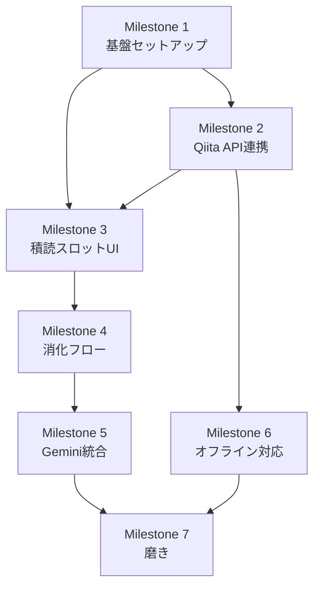
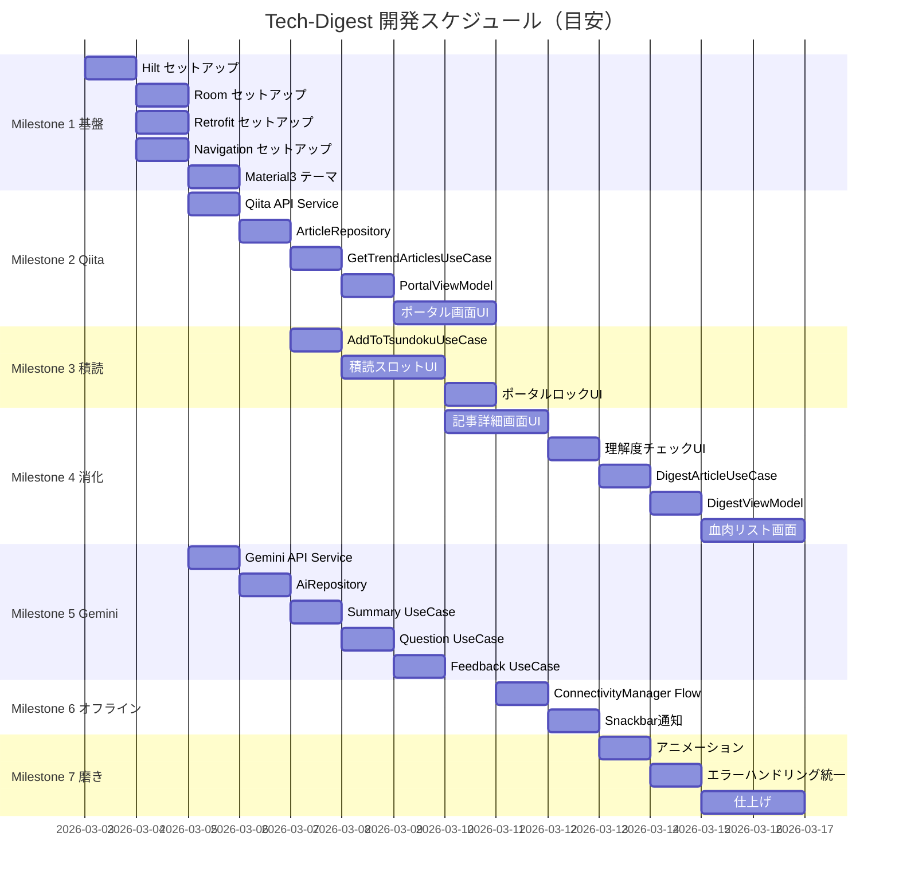

# Tech-Digest Issue 管理

## ラベル定義

| ラベル | 説明 |
|--------|------|
| `milestone:1-基盤` | プロジェクト基盤セットアップ |
| `milestone:2-qiita` | Qiita API 連携 |
| `milestone:3-tsundoku` | 積読スロット UI |
| `milestone:4-digest` | 消化フロー |
| `milestone:5-gemini` | Gemini AI 統合 |
| `milestone:6-offline` | オフライン対応 |
| `milestone:7-polish` | 磨き・仕上げ |
| `type:feat` | 新機能 |
| `type:fix` | バグ修正 |
| `type:refactor` | リファクタリング |
| `type:chore` | 設定・環境 |
| `priority:high` | 他のIssueのブロッカー |
| `priority:mid` | 通常優先度 |
| `priority:low` | 余裕があれば |

---

## 依存関係マップ

---

## Milestone 1 — プロジェクト基盤セットアップ

### #1 Hilt DI セットアップ
- **ラベル**: `milestone:1-基盤` `type:chore` `priority:high`
- **概要**: アプリ全体のDIフレームワークを導入する
- **タスク**
  - [ ] `build.gradle.kts` に Hilt 依存関係を追加
  - [ ] `@HiltAndroidApp` を Application クラスに付与
  - [ ] `AppModule` を作成し、基本バインディングを定義
- **完了条件**: Hilt を使った ViewModel が起動できること

---

### #2 Room セットアップ
- **ラベル**: `milestone:1-基盤` `type:chore` `priority:high`
- **依存**: #1
- **概要**: ローカルDBの基盤を構築する
- **タスク**
  - [ ] `build.gradle.kts` に Room 依存関係を追加
  - [ ] `ArticleEntity` を定義（id, title, url, tags, createdAt, cachedAt, status, aiSummary）
  - [ ] `DigestEntity` を定義（articleId, aiQuestion, userMemo, aiFeedback, savedAt）
  - [ ] `ArticleDao` / `DigestDao` を作成（基本CRUD）
  - [ ] `AppDatabase` クラスを作成
  - [ ] Hilt Module に Room を登録
- **完了条件**: DBインスタンスが DI で注入できること

---

### #3 Retrofit + OkHttp セットアップ
- **ラベル**: `milestone:1-基盤` `type:chore` `priority:high`
- **依存**: #1
- **概要**: ネットワーク層の基盤を構築する
- **タスク**
  - [ ] `build.gradle.kts` に Retrofit / OkHttp / Gson 依存関係を追加
  - [ ] `NetworkModule` を Hilt Module として作成
  - [ ] `OkHttpClient` にログインターセプターを設定
  - [ ] Base URL を `BuildConfig` で管理
- **完了条件**: Retrofit インスタンスが DI で注入できること

---

### #4 Navigation Compose セットアップ
- **ラベル**: `milestone:1-基盤` `type:chore` `priority:high`
- **依存**: #1
- **概要**: 画面遷移の基盤を構築する
- **タスク**
  - [ ] `build.gradle.kts` に Navigation Compose を追加
  - [ ] `Screen` sealed class / object を定義（Portal, Tsundoku, Digest, Done）
  - [ ] `NavHost` を `MainActivity` に設置
  - [ ] 各画面の仮Composableをルートに登録
- **完了条件**: 画面間の遷移が動作すること

---

### #5 Material3 テーマ設定
- **ラベル**: `milestone:1-基盤` `type:chore` `priority:mid`
- **概要**: アプリ全体のデザインテーマを定義する
- **タスク**
  - [ ] カラースキーム（Primary / Secondary / Surface）を定義
  - [ ] ダークテーマ対応の色設定
  - [ ] `Typography` を設定
  - [ ] `Theme.kt` に統合
- **完了条件**: テーマが全画面に適用されること

---

## Milestone 2 — Qiita API 連携

### #6 Qiita API Service 定義
- **ラベル**: `milestone:2-qiita` `type:feat` `priority:high`
- **依存**: #3
- **概要**: Qiita API のエンドポイントをRetrofitで定義する
- **タスク**
  - [ ] `QiitaApiService` interface を作成
  - [ ] `GET /api/v2/items` （トレンド・タグ別）エンドポイントを定義
  - [ ] レスポンスの `QiitaArticleDto` データクラスを作成
  - [ ] `NetworkModule` に `QiitaApiService` を登録
- **完了条件**: APIコールが実行でき、レスポンスをパースできること

---

### #7 ArticleRepository 実装
- **ラベル**: `milestone:2-qiita` `type:feat` `priority:high`
- **依存**: #2 #6
- **概要**: APIとRoomを橋渡しするRepository層を実装する
- **タスク**
  - [ ] `ArticleRepository` interface を定義
  - [ ] `ArticleRepositoryImpl` を実装
    - [ ] API取得 → DtoからEntityへマッピング
    - [ ] Room保存（`status = PORTAL`）
    - [ ] Room から Flow で記事一覧を返す
  - [ ] Hilt Module に bind
- **完了条件**: `Flow<List<ArticleEntity>>` が正常に流れること

---

### #8 GetTrendArticlesUseCase 実装
- **ラベル**: `milestone:2-qiita` `type:feat` `priority:high`
- **依存**: #7
- **概要**: トレンド記事取得のビジネスロジックを UseCase に切り出す
- **タスク**
  - [ ] `GetTrendArticlesUseCase` を作成
  - [ ] タグ別フィルタリングのロジックを実装
  - [ ] `Result<List<ArticleEntity>>` でラップして返す
- **完了条件**: UseCaseが正常に記事リストを返すこと

---

### #9 PortalViewModel 実装
- **ラベル**: `milestone:2-qiita` `type:feat` `priority:high`
- **依存**: #4 #8
- **概要**: ポータル画面の状態管理を実装する
- **タスク**
  - [ ] `PortalViewModel` を作成（Hilt ViewModel）
  - [ ] `UiState` sealed class を定義（Loading / Success / Error）
  - [ ] `StateFlow<PortalUiState>` を公開
  - [ ] タグ絞り込み用 `selectedTag` StateFlow を追加
  - [ ] 積読スロット数（0〜5）を `tsundokuCount: StateFlow<Int>` で管理
- **完了条件**: ViewModelがUIStateを正しく更新すること

---

### #10 ポータル画面 UI 実装
- **ラベル**: `milestone:2-qiita` `type:feat` `priority:high`
- **依存**: #5 #9
- **概要**: 記事一覧を表示するポータル画面を実装する
- **タスク**
  - [ ] `PortalScreen` Composable を実装
  - [ ] `LazyColumn` で記事カードを一覧表示
  - [ ] `ArticleCard` Composable を実装（タイトル・タグ・日付）
  - [ ] タグフィルター用 `FilterChip` 行を追加
  - [ ] ローディング中は `CircularProgressIndicator`
  - [ ] エラー時はリトライボタンを表示
- **完了条件**: Qiita記事が画面に一覧表示されること

---

## Milestone 3 — 積読スロット UI

### #11 AddToTsundokuUseCase 実装
- **ラベル**: `milestone:3-tsundoku` `type:feat` `priority:high`
- **依存**: #7
- **概要**: 積読追加のビジネスロジックを実装する
- **タスク**
  - [ ] `AddToTsundokuUseCase` を作成
  - [ ] 追加前にスロット数（< 5）をチェック
  - [ ] `ArticleEntity.status` を `TSUNDOKU` に更新
  - [ ] スロット満杯の場合は `SlotFullException` をスロー
- **完了条件**: 5件制限が正しく機能すること

---

### #12 積読スロット UI 実装
- **ラベル**: `milestone:3-tsundoku` `type:feat` `priority:high`
- **依存**: #4 #5 #11
- **概要**: 積読リスト画面（最大5スロット）を実装する
- **タスク**
  - [ ] `TsundokuScreen` Composable を実装
  - [ ] 5枠固定スロットのグリッドUI（空き枠は破線カード）
  - [ ] 各スロットに記事タイトル・タグを表示
  - [ ] 「AI要約」ボタンをカードに配置
  - [ ] `TsundokuViewModel` を実装（StateFlow管理）
- **完了条件**: 積読一覧が5スロットで表示されること

---

### #13 ポータルの積読満杯ロック UI
- **ラベル**: `milestone:3-tsundoku` `type:feat` `priority:high`
- **依存**: #10 #11
- **概要**: スロット満杯時にポータルをロック表示する
- **タスク**
  - [ ] `tsundokuCount == 5` の時、各 `ArticleCard` をグレーアウト
  - [ ] グレーアウト中は「積読に追加」ボタンを無効化
  - [ ] 上部にロック理由を示すバナーを表示
- **完了条件**: 5件到達でポータルがロック状態になること

---

## Milestone 4 — 消化フロー

### #14 記事詳細画面 UI 実装
- **ラベル**: `milestone:4-digest` `type:feat` `priority:high`
- **依存**: #4 #5
- **概要**: 記事本文を表示する詳細画面を実装する
- **タスク**
  - [ ] `DigestScreen` Composable を実装
  - [ ] `WebView` を Compose に埋め込む（`AndroidView`）
  - [ ] 上部に記事タイトル・タグを表示
  - [ ] ポータルからの遷移時は「積読に追加」ボタンを表示
  - [ ] 積読からの遷移時は「AI要約」「読了宣言」ボタンを表示
- **完了条件**: WebViewで記事が表示され、ボタンが正しく出し分けられること

---

### #15 理解度チェック・メモ入力 UI 実装
- **ラベル**: `milestone:4-digest` `type:feat` `priority:high`
- **依存**: #14
- **概要**: 読了後の理解度チェックとメモ入力フローを実装する
- **タスク**
  - [ ] 読了宣言後に AI 問いを表示するセクションを実装
  - [ ] 問いの下に「これはAIが生成した提案です」の注記を表示
  - [ ] 一行メモ入力用 `TextField` を実装
  - [ ] 「送信」ボタンで フィードバック取得フローへ
  - [ ] フィードバック表示後に「消化する」ボタンを表示
- **完了条件**: 問い→メモ入力→フィードバック→消化ボタンの流れが動作すること

---

### #16 DigestArticleUseCase 実装
- **ラベル**: `milestone:4-digest` `type:feat` `priority:high`
- **依存**: #2 #7
- **概要**: 消化実行のビジネスロジックを実装する
- **タスク**
  - [ ] `DigestArticleUseCase` を作成
  - [ ] `ArticleEntity.status` を `DONE` に更新
  - [ ] `DigestEntity` にメモ・フィードバックを保存
  - [ ] 積読スロットの解放を確認（count - 1）
- **完了条件**: 消化後に status が DONE になり、スロットが解放されること

---

### #17 DigestViewModel 実装
- **ラベル**: `milestone:4-digest` `type:feat` `priority:high`
- **依存**: #15 #16
- **概要**: 消化画面の状態管理をまとめる
- **タスク**
  - [ ] `DigestViewModel` を作成（Hilt ViewModel）
  - [ ] `DigestUiState` を定義（WebLoading / ReadMode / QuestionMode / FeedbackMode / Done）
  - [ ] 各フロー（要約・問い・フィードバック・消化）のイベントを実装
  - [ ] Navigation への一方向通知（`SharedFlow`）を設定
- **完了条件**: UiState遷移が正しく動作すること

---

### #18 血肉リスト画面 UI 実装
- **ラベル**: `milestone:4-digest` `type:feat` `priority:mid`
- **依存**: #4 #5 #16
- **概要**: 消化済み記事の一覧・詳細を実装する
- **タスク**
  - [ ] `DoneScreen` Composable を実装
  - [ ] `LazyColumn` で消化済みカードを一覧表示
  - [ ] カードにタイトル・消化日・一行メモのプレビューを表示
  - [ ] タップで詳細（メモ全文 + AIフィードバック）を表示
  - [ ] `GetDoneArticlesUseCase` / `DoneViewModel` を実装
- **完了条件**: 消化済み記事が一覧表示され、詳細確認できること

---

## Milestone 5 — Gemini AI 統合

### #19 Gemini API Service 定義
- **ラベル**: `milestone:5-gemini` `type:feat` `priority:high`
- **依存**: #3
- **概要**: Gemini API の呼び出し層を実装する
- **タスク**
  - [ ] `GeminiApiService` interface を作成（Retrofit）
  - [ ] リクエスト / レスポンスの DTO を定義
  - [ ] API キーを `local.properties` + `BuildConfig` で管理（ハードコード禁止）
  - [ ] `NetworkModule` に登録
- **完了条件**: Gemini API を呼び出してレスポンスが取得できること

---

### #20 AiRepository 実装
- **ラベル**: `milestone:5-gemini` `type:feat` `priority:high`
- **依存**: #19
- **概要**: AI関連のRepository層を実装する
- **タスク**
  - [ ] `AiRepository` interface を定義
  - [ ] `AiRepositoryImpl` を実装
  - [ ] エラーハンドリング（タイムアウト / レートリミット）
  - [ ] Hilt Module に bind
- **完了条件**: AIレスポンスが Result でラップされて返ること

---

### #21 GenerateSummaryUseCase 実装
- **ラベル**: `milestone:5-gemini` `type:feat` `priority:high`
- **依存**: #20 #7
- **概要**: 記事全文をAIに読ませて要約を生成するUseCaseを実装する
- **タスク**
  - [ ] `GenerateSummaryUseCase` を作成
  - [ ] `ArticleEntity.body`（記事全文）をプロンプトに渡す（先頭10,000文字）
  - [ ] プロンプト: 「以下の記事全文を読んで重要なポイントを3行で要約してください」
  - [ ] 生成結果を `ArticleEntity.aiSummary` に保存
  - [ ] 既にDB保存済みの場合はAPIを呼ばずDBから返す（Cache-First）
- **完了条件**: 全文ベースの要約が生成・保存され、再タップ時はDBから取得されること

---

### #22 GenerateQuestionUseCase 実装
- **ラベル**: `milestone:5-gemini` `type:feat` `priority:high`
- **依存**: #20
- **概要**: 記事全文をAIに読ませて内容に即した理解度チェック問いを生成するUseCaseを実装する
- **タスク**
  - [ ] `GenerateQuestionUseCase` を作成
  - [ ] `ArticleEntity.body`（記事全文）をプロンプトに渡す（先頭10,000文字）
  - [ ] プロンプト: 「記事全文を読んで内容に即した理解度確認の問いを1つ生成してください」
  - [ ] 生成結果を `DigestEntity.aiQuestion` に保存
  - [ ] 既にDB保存済みの場合はAPIを呼ばずDBから返す（Cache-First）
- **完了条件**: 全文ベースの問いが生成されUIに表示されること

---

### #23 GenerateFeedbackUseCase 実装
- **ラベル**: `milestone:5-gemini` `type:feat` `priority:high`
- **依存**: #20 #2
- **概要**: 記事全文・問い・ユーザー回答からAIフィードバックと理解度評価を生成するUseCaseを実装する
- **タスク**
  - [ ] `FeedbackResult(feedback: String, isUnderstandingSufficient: Boolean)` データクラスを定義
  - [ ] `GenerateFeedbackUseCase` を作成（戻り値: `Result<FeedbackResult>`）
  - [ ] `ArticleEntity.body` + `question` + `userMemo` をプロンプトに渡す
  - [ ] プロンプト: 「記事全文・問い・回答を踏まえ理解度を評価（OK/NG）しフィードバックしてください」
  - [ ] 出力形式: `JUDGMENT: OK/NG
FEEDBACK: <text>` を `parseFeedbackResponse()` でパース
  - [ ] 生成結果（`aiFeedback` + `isUnderstandingSufficient`）を `DigestEntity` に保存
  - [ ] `DigestDao.updateFeedback(articleId, memo, feedback, isUnderstandingSufficient)` を追加
- **完了条件**:
  - フィードバックが生成・保存されUIに表示されること
  - `isUnderstandingSufficient == true` の時のみ「消化する」ボタンが有効になること
  - `isUnderstandingSufficient == false` の時はボタン無効・再回答を促すメッセージが表示されること

---

## Milestone 6 — オフライン対応

### #24 ConnectivityManager Flow 実装
- **ラベル**: `milestone:6-offline` `type:feat` `priority:high`
- **依存**: #1
- **概要**: ネットワーク接続状態を Flow で監視する
- **タスク**
  - [ ] `NetworkMonitor` クラスを作成（`ConnectivityManager` + `Flow<Boolean>`）
  - [ ] Hilt で提供
  - [ ] `PortalViewModel` から購読
- **完了条件**: オンライン/オフライン切り替えを Flow で検知できること

---

### #25 オフライン時の Snackbar 通知
- **ラベル**: `milestone:6-offline` `type:feat` `priority:high`
- **依存**: #10 #24
- **概要**: オフライン時にユーザーへ通知し、キャッシュを表示する
- **タスク**
  - [ ] `PortalScreen` に `SnackbarHost` を配置
  - [ ] オフライン検知で「オフラインです。キャッシュを表示しています」を表示
  - [ ] API失敗時も同様のSnackbarを表示
  - [ ] RoomキャッシュをFlowで取得して一覧を継続表示
- **完了条件**: オフライン時にSnackbarが表示され、キャッシュ記事が表示されること

---

## Milestone 7 — 磨き・仕上げ

### #26 画面遷移アニメーション
- **ラベル**: `milestone:7-polish` `type:feat` `priority:low`
- **依存**: #4
- **概要**: 画面遷移に滑らかなアニメーションを追加する
- **タスク**
  - [ ] `NavHost` に `EnterTransition` / `ExitTransition` を設定
  - [ ] スライドイン/フェードアウトを実装
- **完了条件**: 画面遷移にアニメーションが付いていること

---

### #27 エラーハンドリング統一
- **ラベル**: `milestone:7-polish` `type:refactor` `priority:mid`
- **依存**: #8 #21 #22 #23
- **概要**: アプリ全体のエラー表示を統一する
- **タスク**
  - [ ] `AppError` sealed class を定義（Network / AiError / Unknown）
  - [ ] 各UseCase の Result を `AppError` に統一
  - [ ] エラー時のUI（テキスト・アイコン・リトライボタン）を共通Composableに切り出す
- **完了条件**: 全エラーが統一されたUIで表示されること

---

### #28 積読スロット空き枠アニメーション
- **ラベル**: `milestone:7-polish` `type:feat` `priority:low`
- **依存**: #12
- **概要**: 積読スロットの追加・削除にアニメーションを追加する
- **タスク**
  - [ ] スロット追加時に `animateItemPlacement`
  - [ ] 消化完了時にスロット解放アニメーション（縮小 → 空き枠）
- **完了条件**: 視覚的にスロット変化が伝わること

---

### #29 AI生成中ローディング表示
- **ラベル**: `milestone:7-polish` `type:feat` `priority:mid`
- **依存**: #21 #22 #23
- **概要**: AI生成中にローディング表示をする
- **タスク**
  - [ ] 「AI要約」「問い生成」「フィードバック」各ボタンに生成中スピナーを表示
  - [ ] 生成中はボタンを無効化
  - [ ] Lottieアニメーション or `CircularProgressIndicator`
- **完了条件**: AI処理中にユーザーが待機状態を認識できること

---

### #30 再生成ボタン実装
- **ラベル**: `milestone:7-polish` `type:feat` `priority:mid`
- **依存**: #21
- **概要**: AI要約を再生成できるボタンを実装する
- **タスク**
  - [ ] 「要約を再生成」ボタンを積読カードに追加
  - [ ] タップで `aiSummary` を上書き保存
- **完了条件**: 再生成ボタンで要約が更新されること

---

## 進捗サマリー

