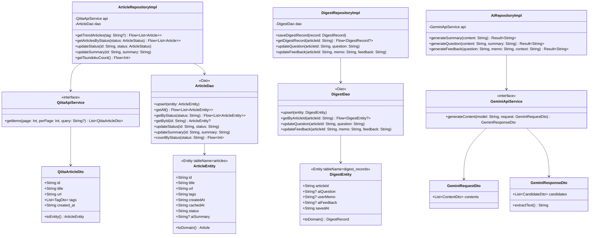
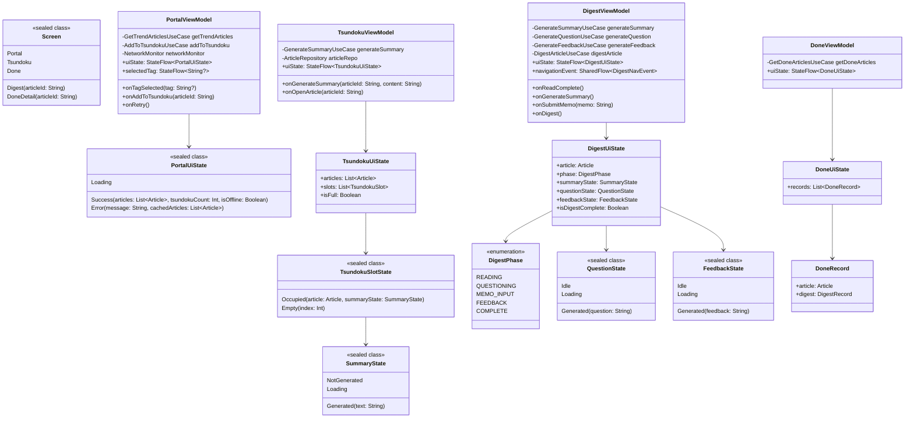
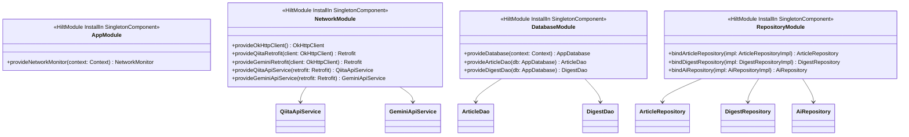
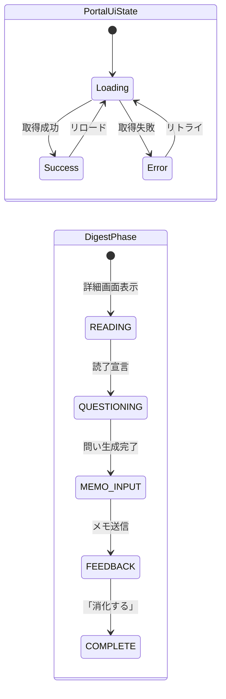
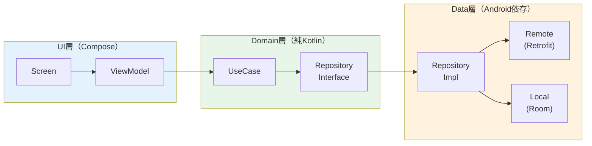
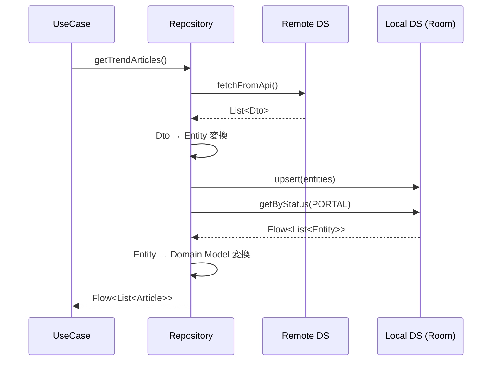
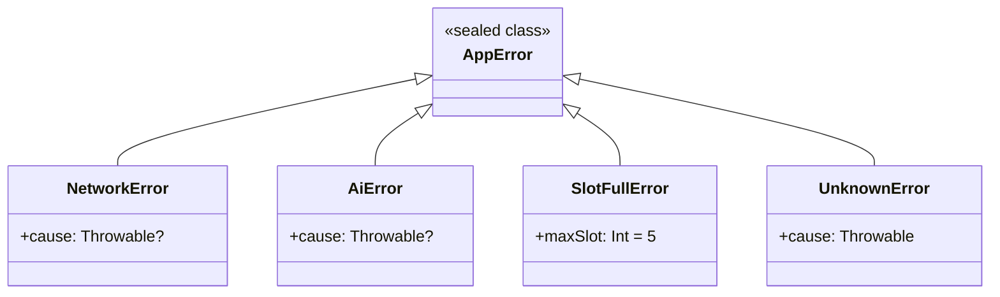
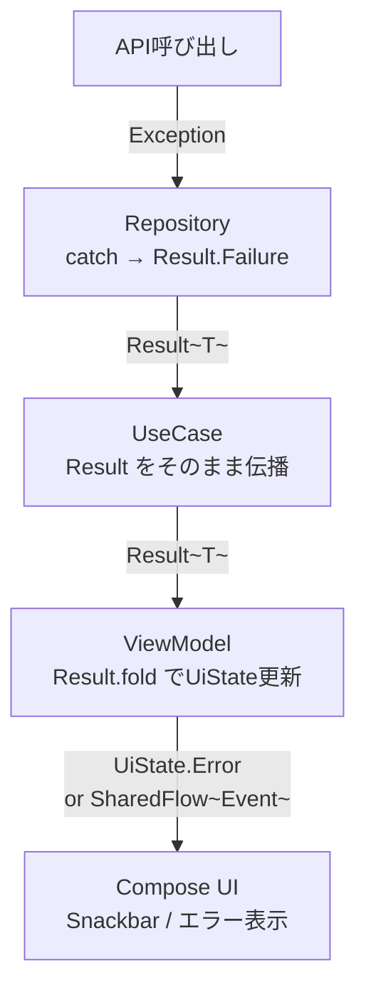
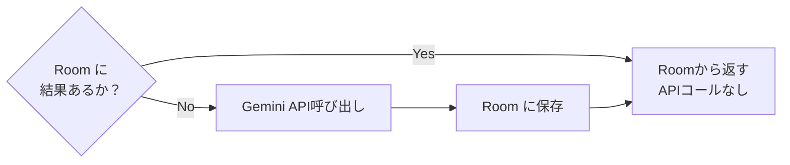

# Tech-Digest 技術設計ドキュメント

## 目次
1. [パッケージ構成](#1-パッケージ構成)
2. [クラス図 — Domain層](#2-クラス図--domain層)
3. [クラス図 — Data層](#3-クラス図--data層)
4. [クラス図 — UI層](#4-クラス図--ui層)
5. [クラス図 — DI構成](#5-クラス図--di構成)
6. [UiState 設計](#6-uistate-設計)
7. [アーキテクチャ選定とトレードオフ](#7-アーキテクチャ選定とトレードオフ)
8. [技術スタック選定とトレードオフ](#8-技術スタック選定とトレードオフ)
9. [エラーハンドリング戦略](#9-エラーハンドリング戦略)
10. [パフォーマンス考慮点](#10-パフォーマンス考慮点)

---

## 1. パッケージ構成

```
com.example.oto1720.dojo2026/
│
├── di/                              # Hilt モジュール
│   ├── AppModule.kt
│   ├── NetworkModule.kt
│   └── DatabaseModule.kt
│
├── data/                            # Data層
│   ├── local/
│   │   ├── db/
│   │   │   ├── AppDatabase.kt
│   │   │   ├── ArticleDao.kt
│   │   │   └── DigestDao.kt
│   │   └── entity/
│   │       ├── ArticleEntity.kt
│   │       └── DigestEntity.kt
│   ├── remote/
│   │   ├── qiita/
│   │   │   ├── QiitaApiService.kt
│   │   │   └── dto/
│   │   │       └── QiitaArticleDto.kt
│   │   └── gemini/
│   │       ├── GeminiApiService.kt
│   │       └── dto/
│   │           ├── GeminiRequestDto.kt
│   │           └── GeminiResponseDto.kt
│   └── repository/
│       ├── ArticleRepositoryImpl.kt
│       ├── DigestRepositoryImpl.kt
│       └── AiRepositoryImpl.kt
│
├── domain/                          # Domain層
│   ├── model/
│   │   ├── Article.kt               # ドメインモデル
│   │   ├── DigestRecord.kt
│   │   └── ArticleStatus.kt         # enum: PORTAL / TSUNDOKU / DONE
│   ├── repository/                  # Repositoryインターフェース
│   │   ├── ArticleRepository.kt
│   │   ├── DigestRepository.kt
│   │   └── AiRepository.kt
│   └── usecase/
│       ├── article/
│       │   ├── GetTrendArticlesUseCase.kt
│       │   ├── AddToTsundokuUseCase.kt
│       │   └── DigestArticleUseCase.kt
│       ├── ai/
│       │   ├── GenerateSummaryUseCase.kt
│       │   ├── GenerateQuestionUseCase.kt
│       │   └── GenerateFeedbackUseCase.kt
│       └── done/
│           └── GetDoneArticlesUseCase.kt
│
├── ui/                              # UI層
│   ├── navigation/
│   │   ├── Screen.kt
│   │   └── AppNavHost.kt
│   ├── portal/
│   │   ├── PortalScreen.kt
│   │   ├── PortalViewModel.kt
│   │   ├── PortalUiState.kt
│   │   └── components/
│   │       ├── ArticleCard.kt
│   │       └── TagFilterRow.kt
│   ├── tsundoku/
│   │   ├── TsundokuScreen.kt
│   │   ├── TsundokuViewModel.kt
│   │   ├── TsundokuUiState.kt
│   │   └── components/
│   │       ├── TsundokuSlot.kt
│   │       └── EmptySlot.kt
│   ├── digest/
│   │   ├── DigestScreen.kt
│   │   ├── DigestViewModel.kt
│   │   ├── DigestUiState.kt
│   │   └── components/
│   │       ├── ArticleWebView.kt
│   │       ├── AiSummaryCard.kt
│   │       ├── QuestionCard.kt
│   │       ├── MemoInputField.kt
│   │       └── FeedbackCard.kt
│   ├── done/
│   │   ├── DoneScreen.kt
│   │   ├── DoneViewModel.kt
│   │   ├── DoneUiState.kt
│   │   └── components/
│   │       └── DoneArticleCard.kt
│   └── theme/
│       ├── Color.kt
│       ├── Theme.kt
│       └── Type.kt
│
├── util/
│   ├── NetworkMonitor.kt            # ConnectivityManager + Flow
│   └── AppError.kt                  # エラー定義
│
└── MainActivity.kt
```

---

## 2. クラス図 — Domain層

```mermaid
classDiagram
    %% ─── Enum ───
    class ArticleStatus {
        <<enumeration>>
        PORTAL
        TSUNDOKU
        DONE
    }

    %% ─── Domain Models ───
    class Article {
        +String id
        +String title
        +String url
        +List~String~ tags
        +String createdAt
        +String cachedAt
        +ArticleStatus status
        +String? aiSummary
    }

    class DigestRecord {
        +String articleId
        +String? aiQuestion
        +String? userMemo
        +String? aiFeedback
        +String savedAt
    }

    Article --> ArticleStatus

    %% ─── Repository Interfaces ───
    class ArticleRepository {
        <<interface>>
        +getTrendArticles(tag: String?) Flow~List~Article~~
        +getArticlesByStatus(status: ArticleStatus) Flow~List~Article~~
        +updateStatus(id: String, status: ArticleStatus)
        +updateSummary(id: String, summary: String)
        +getTsundokuCount() Flow~Int~
    }

    class DigestRepository {
        <<interface>>
        +saveDigestRecord(record: DigestRecord)
        +getDigestRecord(articleId: String) Flow~DigestRecord?~
        +updateQuestion(articleId: String, question: String)
        +updateFeedback(articleId: String, memo: String, feedback: String)
    }

    class AiRepository {
        <<interface>>
        +generateSummary(articleContent: String) Result~String~
        +generateQuestion(articleContent: String, summary: String) Result~String~
        +generateFeedback(question: String, memo: String, context: String) Result~String~
    }

    %% ─── UseCases ───
    class GetTrendArticlesUseCase {
        -ArticleRepository articleRepo
        +invoke(tag: String?) Flow~Result~List~Article~~~
    }

    class AddToTsundokuUseCase {
        -ArticleRepository articleRepo
        +invoke(articleId: String) Result~Unit~
    }

    class DigestArticleUseCase {
        -ArticleRepository articleRepo
        -DigestRepository digestRepo
        +invoke(articleId: String, memo: String, feedback: String) Result~Unit~
    }

    class GenerateSummaryUseCase {
        -AiRepository aiRepo
        -ArticleRepository articleRepo
        +invoke(articleId: String, content: String) Flow~Result~String~~
    }

    class GenerateQuestionUseCase {
        -AiRepository aiRepo
        -DigestRepository digestRepo
        +invoke(articleId: String, content: String, summary: String?) Result~String~
    }

    class GenerateFeedbackUseCase {
        -AiRepository aiRepo
        -DigestRepository digestRepo
        +invoke(articleId: String, question: String, memo: String, context: String) Result~String~
    }

    class GetDoneArticlesUseCase {
        -ArticleRepository articleRepo
        -DigestRepository digestRepo
        +invoke() Flow~List~Pair~Article, DigestRecord~~~
    }

    GetTrendArticlesUseCase --> ArticleRepository
    AddToTsundokuUseCase --> ArticleRepository
    DigestArticleUseCase --> ArticleRepository
    DigestArticleUseCase --> DigestRepository
    GenerateSummaryUseCase --> AiRepository
    GenerateSummaryUseCase --> ArticleRepository
    GenerateQuestionUseCase --> AiRepository
    GenerateQuestionUseCase --> DigestRepository
    GenerateFeedbackUseCase --> AiRepository
    GenerateFeedbackUseCase --> DigestRepository
    GetDoneArticlesUseCase --> ArticleRepository
    GetDoneArticlesUseCase --> DigestRepository
```



---

## 3. クラス図 — Data層



---

## 4. クラス図 — UI層



---

## 5. クラス図 — DI構成



---

## 6. UiState 設計

各画面の `UiState` は **sealed class** で表現し、`StateFlow` で公開する。
`SharedFlow` はナビゲーションなど「一度きりのイベント」専用とする。



### StateFlow vs SharedFlow 使い分け

| 用途 | 型 | 理由 |
|------|-----|------|
| 画面全体の状態 | `StateFlow<UiState>` | 最新値を常に保持、再購読時に再取得不要 |
| 一方向イベント（ナビゲーション・Snackbar） | `SharedFlow<Event>` | 再配信しない、複数コレクター対応 |
| テキスト入力 | `MutableStateFlow<String>` | バッファ不要の単純な値 |

---

## 7. アーキテクチャ選定とトレードオフ

### 7-1. MVVM vs MVI

```mermaid
quadrantChart
    title アーキテクチャパターン比較
    x-axis 実装コスト低 --> 実装コスト高
    y-axis 状態管理の予測可能性低 --> 状態管理の予測可能性高
    quadrant-1 理想（高予測・低コスト）
    quadrant-2 過剰
    quadrant-3 避けるべき
    quadrant-4 今後の選択肢
    MVVM(StateFlow): [0.35, 0.65]
    MVI(Orbit/Circuit): [0.75, 0.90]
    MVP: [0.25, 0.45]
    MVVM(LiveData): [0.20, 0.50]
```

| 観点 | MVVM + StateFlow ✅採用 | MVI (Orbit / Circuit) |
|------|-------------------------|----------------------|
| 学習コスト | 低（Android公式推奨） | 高（Intent/Reducer概念が必要） |
| 状態の予測可能性 | 高（UiState sealed class） | 非常に高（単方向データフロー） |
| ボイラープレート | 中 | 多（Intent定義が増える） |
| Dojoの評価適合性 | ◎ 標準的で審査しやすい | △ 過剰設計に見える可能性 |
| テスタビリティ | 高 | 非常に高 |

**決定**: **MVVM + StateFlow** を採用。
`UiState` を `sealed class` で表現することで MVI 的な単方向性を確保しつつ、実装コストを抑える。

---

### 7-2. Single Activity vs Multi Activity

| 観点 | Single Activity ✅採用 | Multi Activity |
|------|------------------------|----------------|
| Compose との親和性 | ◎ Navigation Compose が前提 | △ Compose間遷移が煩雑 |
| バックスタック管理 | NavHost で一元管理 | Activity間のバックスタックが複雑 |
| ViewModel スコープ | Hilt NavGraph-scoped ViewModel | Activity ごとに分断 |
| ディープリンク | NavHost で容易 | IntentのURL設計が必要 |

**決定**: **Single Activity** を採用。`MainActivity` + `NavHost` のみ。

---

### 7-3. Clean Architecture の層分割



| 観点 | UseCase層を設ける ✅採用 | ViewModel直接Repo呼び出し |
|------|------------------------|--------------------------|
| テスタビリティ | ◎ UseCaseを単独でテスト可 | △ ViewModelのテストが重くなる |
| 責務の明確さ | ◎ ビジネスロジックが独立 | △ ViewModelが肥大化しやすい |
| 実装コスト | やや高（クラス数が増える） | 低 |
| Dojo要件 | ◎ Clean Architecture明記 | △ 要件未達 |

**決定**: **UseCase層を設ける**。ただし1UseCaseにつき1つの責務に絞り、肥大化を防ぐ。

---

### 7-4. Repositoryパターンの責務境界



**重要な設計判断**: Repository は常に **Room を Single Source of Truth** とする。
API → Room → Flow の順に流すことで、オフライン対応とリアルタイム更新を両立。

---

## 8. 技術スタック選定とトレードオフ

### 8-1. ローカルDB: Room vs DataStore vs SQLDelight

| 観点 | Room ✅採用 | DataStore | SQLDelight |
|------|------------|-----------|------------|
| 複雑なクエリ | ◎ SQL / DAO | △ Key-Value のみ | ◎ |
| Kotlin Flow対応 | ◎ | ◎ | ◎ |
| マイグレーション | 手動定義が必要 | 不要（シンプル） | 型安全なマイグレーション |
| Android公式 | ◎ | ◎ | △（JetBrains製） |
| 学習コスト | 低（Dojo向け） | 非常に低 | 高 |
| 向いているデータ | リレーショナル | 設定値 | リレーショナル |

**決定**: **Room** を採用。記事・消化記録の関係性をDAO + Entityで扱うのに最適。

---

### 8-2. ネットワーク: Retrofit + OkHttp vs Ktor

| 観点 | Retrofit + OkHttp ✅採用 | Ktor Client |
|------|--------------------------|-------------|
| Android での実績 | ◎ デファクトスタンダード | △ 比較的新しい |
| インターフェース定義 | ◎ interface + アノテーション | コードベース |
| ログ・インターセプター | ◎ OkHttp Interceptor | プラグイン方式 |
| KMP対応 | △（Android専用） | ◎（Multiplatform） |
| 学習コスト | 低 | 中 |

**決定**: **Retrofit + OkHttp** を採用。実績・情報量・Hiltとの相性を優先。

---

### 8-3. 記事表示: WebView vs Markdown Renderer

| 観点 | WebView ✅採用 | Markdown Renderer (Compose-Markdown等) |
|------|---------------|---------------------------------------|
| 実装コスト | 低（URLをそのまま開く） | 高（Markdown取得→パース→描画） |
| 体験品質 | 元サイトのデザインそのまま | アプリ統一のデザイン |
| 広告・ノイズ | 元サイトの広告も表示される | クリーンな表示 |
| Qiita記事 | ◎ WebViewで十分 | APIでMarkdownを取得すれば可 |
| オフライン | △（URLは開けない） | ◎（Markdown文字列をキャッシュ） |

**決定**: **WebView** をメインに採用（`AndroidView` でCompose内に埋め込み）。
オフライン対応は記事URLのキャッシュではなく、積読追加時にMarkdown本文をRoomに保存する方法も検討余地あり（今回はスコープ外）。

---

### 8-4. 非同期処理: Coroutines + Flow vs RxJava

| 観点 | Coroutines + Flow ✅採用 | RxJava |
|------|--------------------------|--------|
| Kotlin ネイティブ | ◎ | △（Java起源） |
| Room / Retrofit との統合 | ◎ 公式サポート | ◎ アダプター経由 |
| 学習コスト | 中 | 高 |
| 構造化並行性 | ◎ CoroutineScope | △ Disposable管理が必要 |
| Android公式推奨 | ◎ | △ |

**決定**: **Coroutines + Flow** を採用。Android公式推奨であり、Hilt ViewModel Scopeとの相性が最良。

---

### 8-5. AI API: Gemini API（REST） vs Gemini Android SDK

| 観点 | Gemini REST API via Retrofit ✅採用 | Gemini Android SDK (google-ai-client) |
|------|-------------------------------------|--------------------------------------|
| 既存Retrofitとの統合 | ◎ 追加依存なし | △ 別SDK追加 |
| ストリーミング応答 | △ 別実装が必要 | ◎ 標準対応 |
| APIキー管理 | BuildConfig で管理 | BuildConfig で管理 |
| 型安全 | DTO自前定義が必要 | ◎ SDK型あり |
| 実装透明性 | ◎ Dojoの採点者にわかりやすい | △ 内部実装が隠蔽 |

**決定**: **Retrofit経由のREST呼び出し** を採用。既存の `NetworkModule` に統合でき、実装意図がDojo採点者に伝わりやすい。

---

## 9. エラーハンドリング戦略



### エラー伝播フロー



**ポリシー**:
- Repository 層で `try-catch` → `Result<T>` に変換
- UseCase は `Result<T>` をそのまま上流へ渡す（再ラップしない）
- ViewModel の `onXxx()` 関数で `Result.fold` し、UiState を更新
- AI エラーは「生成できませんでした。再試行してください」と表示し、リトライボタンを提供

---

## 10. パフォーマンス考慮点

### 10-1. LazyColumn の最適化

```kotlin
// keyを指定してRecompositionを最小化
LazyColumn {
    items(
        items = articles,
        key = { article -> article.id }   // ← 必須
    ) { article ->
        ArticleCard(article = article)
    }
}
```

### 10-2. Flow の購読ライフサイクル

| 収集方法 | 挙動 | 推奨シーン |
|---------|------|-----------|
| `collectAsStateWithLifecycle()` | STARTED以上のみ購読 | ✅ 通常のUI StateFlow |
| `LaunchedEffect + collect` | Composable起動中常に購読 | SharedFlow（一度きりイベント） |
| `collectAsState()` | 常に購読（バックグラウンドでも） | ❌ バッテリー消費に注意 |

**決定**: `StateFlow` の収集は常に `collectAsStateWithLifecycle()` を使用。

### 10-3. Room クエリの Flow 化

```
Room Flow → Repository → UseCase → ViewModel StateFlow
```

Room の DAO が `Flow<List<Entity>>` を返すことで、DB 更新が自動的に UI まで伝播する。
`distinctUntilChanged()` をはさみ、不要な再描画を防ぐ。

### 10-4. AI 呼び出しのキャッシュ戦略



- 要約 (`aiSummary`) はRoom保存済みなら再生成しない（再生成ボタンは別途提供）
- 問い (`aiQuestion`) / フィードバック (`aiFeedback`) も同様
